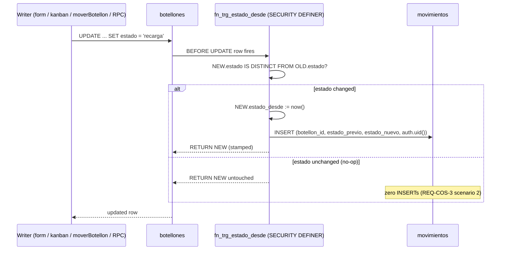
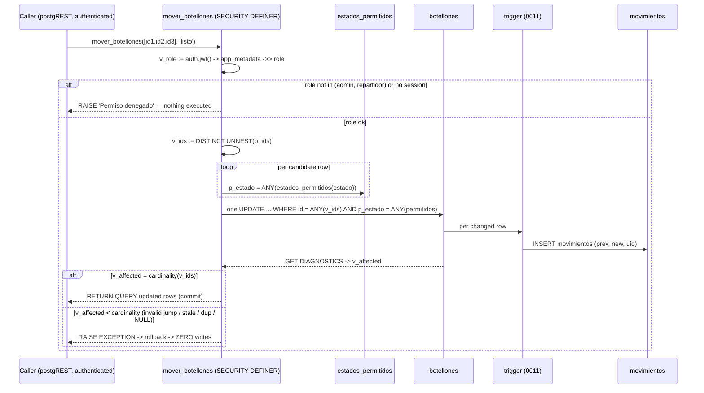

# Design: Central de Operaciones — Fase 1 (FIFO schema, audit trail, batch mover RPC)

**Change**: `central-op-fase1-schema`
**Specs**: `specs/central-operaciones-schema/spec.md` (REQ-COS-1..7), `specs/botellon-ciclo-estados/spec.md` (2 MODIFIED)
**Approach source**: proposal.md (locked business rules + Approach Comparison)

## Technical Approach

Two SQL migrations + a pure TS layer, no UI:

- **0011** adds `botellones.estado_desde` (NOT NULL DEFAULT now()) + per-estado backfill, creates the `movimientos` audit table with RLS mirroring the 0001 admin/repartidor policy style, and installs a SECURITY DEFINER `BEFORE UPDATE` trigger that stamps `estado_desde` and appends a `movimientos` row whenever `estado` actually changes. Old writers (`moverBotellon`/`updateBotellon`), realtime publication 0010, and `estados.ts` stay untouched — the trigger retrofits every existing write path.
- **0012** adds a SQL helper `estados_permitidos(text) -> text[]` (CASE mirror of `getEstadosPermitidos`) and the RPC `mover_botellones(uuid[], text)`: SECURITY DEFINER, JWT role guard, single transactional `UPDATE ... WHERE id = ANY(v_ids) AND p_estado = ANY(estados_permitidos(estado))`, `GET DIAGNOSTICS` row-count vs `cardinality(DISTINCT p_ids)`, mismatch → exception → zero writes.
- **TS layer**: pure `agrupar()` in `src/lib/utils/grupos.ts` (+ vitest matrix), hand-updated `src/types/database.ts`, `rls-policies.test.ts` gains the `movimientos` expectation.

Key property: validation lives **inside** the UPDATE's WHERE, so the batch move is TOCTOU-free — the estado checked is the one being updated, atomically, in one statement.

---

## Migration 0011 — `supabase/migrations/0011_fifo_estado_desde.sql`

Sequence (each step idempotent):

1. **Column**: `ALTER TABLE public.botellones ADD COLUMN IF NOT EXISTS estado_desde timestamptz NOT NULL DEFAULT now();` — NOT NULL satisfied immediately via the default; existing rows get `now()` and are then overwritten by the backfill.
2. **Backfill** (Business Rule 1; spec REQ-COS-1) — the exact COALESCE chain:

```sql
UPDATE public.botellones
SET estado_desde = CASE
  WHEN estado = 'entregado' THEN COALESCE(fecha_entrega, fecha_creacion, created_at, now())
  ELSE COALESCE(fecha_creacion, created_at, now())
END;
```

`fecha_creacion` is the app-consistent source (`getBotellones` orders by it — `src/lib/db/botellones.ts:42`); `created_at` is the defensive fallback; `fecha_entrega` only for `entregado` (that state's meaningful time); terminal `now()` only when every source is NULL. Backfilled ages are approximations — exact ages accrue from deployment onward (documented limitation).

3. **Audit table** (REQ-COS-2):

```sql
CREATE TABLE IF NOT EXISTS public.movimientos (
  id            uuid PRIMARY KEY DEFAULT gen_random_uuid(),
  botellon_id   uuid NOT NULL REFERENCES public.botellones(id) ON DELETE CASCADE,
  estado_previo text,
  estado_nuevo  text NOT NULL,
  usuario_id    uuid REFERENCES auth.users(id) ON DELETE SET NULL,
  created_at    timestamptz DEFAULT now()
);
CREATE INDEX IF NOT EXISTS idx_movimientos_botellon ON public.movimientos (botellon_id);
ALTER TABLE public.movimientos ENABLE ROW LEVEL SECURITY;
```

4. **RLS** — mirrors the 0001 style exactly (inline `(auth.jwt() -> 'app_metadata' ->> 'role')` checks, per-op policies, `TO authenticated`): `admin_select_movimientos`, `admin_insert_movimientos`, `admin_update_movimientos`, `admin_delete_movimientos`, `repartidor_select_movimientos`. Service-role writes bypass RLS unaffected. `movimientos` is **not** added to `supabase_realtime` (publication 0010 untouched).

5. **Trigger function** — SECURITY DEFINER with pinned search_path (REQ-COS-3):

```sql
CREATE OR REPLACE FUNCTION public.fn_trg_estado_desde()
RETURNS trigger
LANGUAGE plpgsql
SECURITY DEFINER
SET search_path = ''
AS $$
BEGIN
  IF NEW.estado IS DISTINCT FROM OLD.estado THEN
    NEW.estado_desde := now();
    INSERT INTO public.movimientos (botellon_id, estado_previo, estado_nuevo, usuario_id)
    VALUES (NEW.id, OLD.estado, NEW.estado, auth.uid());
  END IF;
  RETURN NEW;
END;
$$;
```

`auth.uid()` returns NULL for service-role writes (no JWT in request context) → `usuario_id` NULL (REQ-COS-3 scenario 3). `IS DISTINCT FROM` is NULL-safe: a `NULL → 'recibido'` change still fires.

6. **Trigger** — `CREATE TRIGGER` has no `IF NOT EXISTS`, so drop-first for idempotency:

```sql
DROP TRIGGER IF EXISTS trg_estado_desde ON public.botellones;
CREATE TRIGGER trg_estado_desde
  BEFORE UPDATE ON public.botellones
  FOR EACH ROW
  EXECUTE FUNCTION public.fn_trg_estado_desde();
```

### Sequence diagram — trigger stamp + audit



---

## Migration 0012 — `supabase/migrations/0012_rpc_mover_botellones.sql`

### 1. SQL machine mirror (REQ-COS-5)

CASE mirrors, in `getEstadosPermitidos` order (transitions → reversions → identity):
- `TRANSICIONES` — `src/lib/utils/estados.ts:22-28`
- `REVERSIONES` — `src/lib/utils/estados.ts:36-42`
- identity + dedup union — `src/lib/utils/estados.ts:57-59`

```sql
CREATE OR REPLACE FUNCTION public.estados_permitidos(p_estado text)
RETURNS text[]
LANGUAGE sql
STABLE
AS $$
  SELECT CASE p_estado
    WHEN 'entregado' THEN ARRAY['recibido','listo','delivery','entregado']   -- TS:22-28 + 36-42 + identity
    WHEN 'recibido' THEN ARRAY['recarga','entregado','recibido']
    WHEN 'recarga'  THEN ARRAY['listo','recibido','recarga']
    WHEN 'listo'    THEN ARRAY['entregado','delivery','recarga','listo']
    WHEN 'delivery' THEN ARRAY['entregado','listo','delivery']
    ELSE ARRAY[p_estado]  -- unknown estado: only itself (TS `|| []` + identity fallback)
  END;
$$;

REVOKE ALL ON FUNCTION public.estados_permitidos(text) FROM PUBLIC;
GRANT EXECUTE ON FUNCTION public.estados_permitidos(text) TO authenticated;
```

Array order matches the TS Set insertion order, so a direct `=` comparison works in verify. Expected arrays are pinned by `tests/unit/estados.test.ts:162-166` (entregado, recibido) and the S3/S4 invariant tests.

### 2. RPC `mover_botellones` (REQ-COS-4)

```sql
CREATE OR REPLACE FUNCTION public.mover_botellones(p_ids uuid[], p_estado text)
RETURNS SETOF public.botellones
LANGUAGE plpgsql
SECURITY DEFINER
SET search_path = ''
AS $$
DECLARE
  v_role     text;
  v_ids      uuid[];
  v_affected integer;
BEGIN
  -- Role guard: definer bypasses RLS, so authorization must be explicit.
  SELECT (auth.jwt() -> 'app_metadata' ->> 'role') INTO v_role;
  IF v_role IS NULL OR v_role NOT IN ('admin', 'repartidor') THEN
    RAISE EXCEPTION 'Permiso denegado: rol no autorizado para mover botellones';
  END IF;

  -- Dedupe p_ids: the row-count check compares against DISTINCT ids.
  v_ids := ARRAY(SELECT DISTINCT UNNEST(p_ids));

  -- Single transactional UPDATE; validation lives INSIDE the WHERE —
  -- TOCTOU-free: the estado tested is the one being updated, atomically.
  UPDATE public.botellones
  SET estado = p_estado
  WHERE id = ANY(v_ids)
    AND p_estado = ANY(public.estados_permitidos(estado));

  GET DIAGNOSTICS v_affected = ROW_COUNT;

  IF v_affected <> cardinality(v_ids) THEN
    RAISE EXCEPTION 'Transición no permitida: % de % botellones actualizados (destino %)',
      v_affected, cardinality(v_ids), p_estado;
  END IF;

  -- Same transaction: rows are already updated, return them to the caller.
  RETURN QUERY SELECT b.* FROM public.botellones b WHERE b.id = ANY(v_ids);
END;
$$;

REVOKE ALL ON FUNCTION public.mover_botellones(uuid[], text) FROM PUBLIC;
GRANT EXECUTE ON FUNCTION public.mover_botellones(uuid[], text) TO authenticated;
```

Behavior notes (all spec-mandated, no re-derivation needed):
- **Rejection paths** all funnel into the mismatch → `RAISE EXCEPTION` → transaction rollback → **zero writes**: invalid jump (destino not in the row's permitted set, e.g. `recibido → listo`, mirroring botellon-ciclo-estados S5), stale row (concurrently moved — the WHERE re-checks current estado), duplicate ids in `p_ids` (deduped first), unknown `p_estado` (matches nothing), NULL-`estado` rows (`= ANY(ARRAY[NULL])` is NULL → no match), NULL in `p_ids`.
- **Identity move** permitted: `p_estado` = current estado passes `permitidos`; UPDATE succeeds with no `movimientos` row (trigger sees no change).
- **Empty `p_ids`**: `0 = 0` → success returning an empty set (harmless, documented).
- **`entregado` via RPC** never requires/assigns a client and never touches `cliente_id` (machine-only; owner semantics are fase-3 UI).
- The spec's `RETURNING *` is realized as `RETURN QUERY SELECT` in the same transaction — identical result set, no temp-table plumbing (decision D6).

### Sequence diagram — batch move (success + rejection)



---

## TS layer

### `src/lib/utils/grupos.ts` (new — REQ-COS-6)

```typescript
/**
 * Central de Operaciones grouping — pure, UI-agnostic. Fase 3 consumes this
 * to render the client-grouped FIFO queue. Spec REQ-COS-6.
 * Group = cliente_id; group age = min(estado_desde); groups oldest-first;
 * codes oldest-first inside a group; tiebreak codigo asc; NULL key = stock group.
 */
export type BotellonAgrupable = {
  id: string;
  codigo: string;
  estado: string;
  cliente_id: string | null;
  estado_desde: string; // ISO timestamptz
};

export type GrupoCliente = {
  cliente_id: string | null; // null = stock group (valid key, never dropped)
  estado_desde: string;      // group age = min member estado_desde (oldest)
  botellones: BotellonAgrupable[]; // sorted oldest-first; tiebreak codigo asc
};

export function agrupar(botellones: BotellonAgrupable[]): GrupoCliente[] {
  const grupos = new Map<string | null, BotellonAgrupable[]>();
  for (const b of botellones) {
    const miembros = grupos.get(b.cliente_id) ?? [];
    miembros.push(b);
    grupos.set(b.cliente_id, miembros);
  }
  return [...grupos.entries()]
    .map(([cliente_id, miembros]) => {
      const ordenados = [...miembros].sort(
        (a, b) => a.estado_desde.localeCompare(b.estado_desde) || a.codigo.localeCompare(b.codigo)
      );
      return { cliente_id, estado_desde: ordenados[0].estado_desde, botellones: ordenados };
    })
    .sort(
      (a, b) =>
        a.estado_desde.localeCompare(b.estado_desde) || cmpCliente(a.cliente_id, b.cliente_id)
    );
}

/** Group tiebreak for equal ages: cliente_id asc, stock (null) last. */
function cmpCliente(a: string | null, b: string | null): number {
  if (a === b) return 0;
  if (a === null) return 1;
  if (b === null) return -1;
  return a.localeCompare(b);
}
```

**Sort semantics** (documented, testable): `estado_desde` ascending = oldest-first; equal timestamps tiebreak on `codigo` ascending (ISO strings compare lexicographically — safe `localeCompare`); equal group ages tiebreak on `cliente_id` ascending with the stock (null) group last. Total: every input row lands in exactly one group.

### `tests/unit/grupos.test.ts` (new) — test matrix

| # | Test | Covers |
|---|------|--------|
| 1 | two groups, oldest member yesterday vs today → yesterday group first | REQ-COS-6 S1 (groups oldest-first) |
| 2 | client's 3 bottles of different ages → group age = oldest `estado_desde` | REQ-COS-6 S2 |
| 3 | member codes sorted oldest-first inside the group | REQ-COS-6 S2 |
| 4 | two codes with equal `estado_desde` → `codigo` breaks the tie | REQ-COS-6 S4 |
| 5 | rows with `cliente_id IS NULL` form one stock group, never dropped | REQ-COS-6 S3 |
| 6 | totality: sum of members across groups == input length (no row lost, none duplicated) | REQ-COS-6 total |
| 7 | empty input → `[]`; single member → single group | edge |
| 8 | equal group ages → deterministic order, stock group last | group tiebreak decision |

### `src/types/database.ts` (modified — REQ-COS-7, hand-updated per generated-file convention)

Alphabetical insertion points in the existing 14.15-format file:

1. `botellones.Row` — add `estado_desde: string` between `estado` and `fecha_creacion`; `Insert`/`Update` add `estado_desde?: string` (column has DEFAULT, so optional on insert).
2. New `movimientos` table between `fotos_clientes` and `notificaciones`:
   - `Row`: `botellon_id: string; created_at: string | null; estado_nuevo: string; estado_previo: string | null; id: string; usuario_id: string | null`
   - `Insert`: `botellon_id: string; created_at?: string | null; estado_nuevo: string; estado_previo?: string | null; id?: string; usuario_id?: string | null`
   - `Update`: all optional
   - `Relationships`: `[{ foreignKeyName: "movimientos_botellon_id_fkey", columns: ["botellon_id"], isOneToOne: false, referencedRelation: "botellones", referencedColumns: ["id"] }]` — **no** entry for `usuario_id → auth.users`, mirroring `perfiles` (generator omits auth-schema FKs; `database.ts` perfiles has none, L291+).
3. `Functions` — replace `[_ in never]: never`:

```typescript
Functions: {
  mover_botellones: {
    Args: {
      p_ids: string[]   // uuid[] maps to string[]
      p_estado: string
    }
    Returns: undefined | {
      Row: {
        cliente_id: string | null
        codigo: string
        created_at: string | null
        estado: string | null
        estado_desde: string
        fecha_creacion: string | null
        id: string
      }
    }
  }
}
```

(`Returns: undefined | { Row }` is the SETOF-table shape for the 14.15 generator; the apply executor may confirm with `supabase gen types` after 0012 lands.)

### `tests/integration/rls-policies.test.ts` (modified)

- Add to `EXPECTED_POLICIES`: `movimientos: { admin: ['SELECT','INSERT','UPDATE','DELETE'], repartidor: ['SELECT'] }`.
- Update the table-count assertions: `toHaveLength(9)` → `toHaveLength(10)` and the two "all 9 tables" test names → "all 10 tables".

---

## Chained-PR Slice Plan (delivery: ask-always, 400-line budget)

Guard lines (for sdd-tasks): `Decision needed before apply: Yes` · `Chained PRs recommended: Yes` · `400-line budget risk: Medium`.

| Slice | Contents | Est. lines | Commit units (work-unit commits) |
|-------|----------|-----------|----------------------------------|
| **PR-A** (base: feature branch) | 0011 + 0012 SQL migrations | ~220 | `feat(db): fifo estado_desde + movimientos audit + trigger` (0011 + SQL verification) → `feat(db): mover_botellones batch RPC` (0012 + SQL verification) |
| **PR-B** (base: PR-A branch, chained) | TS layer | ~270 | `feat(utils): agrupar grouping util + tests` (grupos.ts + grupos.test.ts + `npm run test`) → `feat(types): estado_desde/movimientos/RPC types + rls test` (database.ts + rls-policies.test.ts + `npm run test`) |

- Each commit is a reviewable work unit: code + its verification together.
- Forecast: PR-A ~220 and PR-B ~270 — both under the 400-line review budget. PR-B's `database.ts` additions are mechanical (55 of its ~270 lines). If the reviewer wants tighter slices, PR-B splits into B1 (grupos + tests, ~205) and B2 (types + rls, ~65).
- Both slices have autonomous scope: PR-A is self-verifiable against the DB and does not type-check against TS; PR-B is pure TS and needs only 0011/0012 applied for the RLS test's expectations to be true (it documents expectations; actual DB queries run at verify).

## Architecture Decisions

| # | Decision | Options considered | Choice | Rationale |
|---|----------|-------------------|--------|-----------|
| D1 | Validation locus | (a) read-validate-write in PL/pgSQL; (b) validation inside UPDATE WHERE + row-count check | (b) | TOCTOU-free: the estado tested is the one being updated, atomically; one statement satisfies all-or-nothing; mismatch → exception → rollback → zero writes. (a) re-introduces the read-check-write race the TS writers already guard with CAS (botellones.ts:316-327). |
| D2 | Trigger security | (a) SECURITY INVOKER; (b) SECURITY DEFINER + `SET search_path = ''` | (b) | The audit INSERT must never be rejected by RLS on `movimientos` under any caller (invoker model would subject the trigger INSERT to the caller's policies); service-role writes bypass RLS anyway. Empty pinned search_path + fully-qualified identifiers closes the definer-function hijack vector. |
| D3 | Backfill source | (a) `created_at`; (b) `fecha_creacion` primary, `created_at` fallback, `fecha_entrega` only for `entregado` | (b) | `fecha_creacion` is app-consistent — `getBotellones` orders by it (botellones.ts:42); `created_at` is the defensive fallback; `fecha_entrega` is `entregado`'s meaningful time. Documented approximation limitation. |
| D4 | Backfill mechanics | (a) add nullable → backfill → `SET NOT NULL`; (b) `ADD COLUMN NOT NULL DEFAULT now()` then UPDATE | (b) | One-step DDL satisfies NOT NULL immediately (spec REQ-COS-1 exact shape); backfill overwrites the default; no transient nullable window. |
| D5 | Machine mirror | (a) new helper table; (b) SQL CASE fn returning `text[]` | (b) | Locked 5-state maps are small; nothing to sync; CASE comments cite estados.ts:22-28/36-42/57-59; verify diffs SQL vs TS; estados.test.ts:160-177 pins the TS side. |
| D6 | RPC return | (a) temp table + `UPDATE ... RETURNING`; (b) `RETURN QUERY SELECT` after the check | (b) | Identical result set in the same transaction; single UPDATE stays the only write; no temp-table plumbing. |
| D7 | p_ids dedupe | (a) compare vs raw `cardinality(p_ids)`; (b) `DISTINCT UNNEST` first | (b) | Duplicate ids would otherwise reject valid batches (`affected < cardinality`); spec mandates `cardinality(DISTINCT p_ids)`. |
| D8 | `movimientos.botellon_id` FK action | (a) RESTRICT; (b) CASCADE; (c) SET NULL | (b) CASCADE | No botellon-delete flow exists; CASCADE keeps the audit table from blocking future physical purges. Tradeoff (documented): deleting a botellon removes its audit history. |
| D9 | RLS policy shape | (a) single broad policy; (b) per-op policies like 0001 | (b) | Exact 0001 style (inline `(auth.jwt() -> 'app_metadata' ->> 'role')` check, admin full CRUD / repartidor SELECT, `TO authenticated`); `rls-policies.test.ts` asserts the same shape. |
| D10 | RPC authorization | (a) rely on RLS (invoker); (b) explicit JWT role check | (b) | SECURITY DEFINER bypasses RLS by definition, so authorization must be explicit; rejects unauthenticated and non-admin/repartidor before any write (REQ-COS-4). |
| D11 | Grouping util | (a) inline in fase-3 dashboard; (b) pure `grupos.ts` total fn | (b) | Pure, unit-testable, UI-agnostic; null `cliente_id` is a valid stock key; equal-age group tiebreak defined (cliente_id asc, stock last) so ordering is deterministic. |
| D12 | `database.ts` updates | (a) regenerate `supabase gen types`; (b) hand-edit | (b) | Existing generated-file convention (file is already stale re `fecha_entrega` from 0005 — hand-edits are the norm); regenerate-and-diff optional at apply time. |

## Data Flow

```
old writers (moverBotellon/updateBotellon) ──┐
form / kanban actions ────────────────────────┼──► botellones UPDATE
                                             │        │  BEFORE UPDATE
mover_botellones RPC ──► single UPDATE ───────┘        ▼
                                    ┌───────── fn_trg_estado_desde ─────────┐
                                    │ estado changed? → stamp estado_desde  │
                                    │                   → INSERT movimientos│
                                    └──────────────────────────────────────┘
botellones rows (estado_desde) ──► agrupar() ──► GrupoCliente[] (fase 3 queue)
```

## File Changes

| File | Action | Description |
|------|--------|-------------|
| `supabase/migrations/0011_fifo_estado_desde.sql` | Create | `estado_desde` + backfill + `movimientos` + RLS + trigger |
| `supabase/migrations/0012_rpc_mover_botellones.sql` | Create | `estados_permitidos` helper + `mover_botellones` RPC |
| `src/lib/utils/grupos.ts` | Create | `BotellonAgrupable`, `GrupoCliente`, `agrupar()` |
| `tests/unit/grupos.test.ts` | Create | 8-test grouping matrix |
| `src/types/database.ts` | Modify | +`estado_desde` (Row/Insert/Update), +`movimientos`, +RPC signature |
| `tests/integration/rls-policies.test.ts` | Modify | +`movimientos` expectation; 9 → 10 tables |

Untouched (guaranteed by scope): `src/lib/utils/estados.ts`, `src/lib/db/botellones.ts`, `src/components/dashboard/operaciones-dashboard.tsx`, `tests/unit/botellones-estado.test.ts`, `tests/unit/estados.test.ts`, migration 0010 (realtime), anon column grant in 0001 (`estado_desde` stays invisible to anon).

## Testing Strategy

| Layer | What to Test | Approach |
|-------|-------------|----------|
| Unit (vitest) | `agrupar()` grouping/ordering/tiebreak/null-key/totality | `tests/unit/grupos.test.ts` matrix (8 tests) |
| Integration (vitest) | RLS expectations for `movimientos` | `tests/integration/rls-policies.test.ts` +`movimientos` entry, count 9→10 |
| DB (supabase MCP/CLI, verify phase) | 0011/0012 behavior | SQL checks per requirement (table below) |
| Regression | existing writers & machine untouched | `npm run test` full suite green; `botellones-estado.test.ts` / `estados.test.ts` unchanged |

## Verification Strategy (per requirement)

| Requirement | How verify proves it |
|-------------|----------------------|
| REQ-COS-1 | SQL: `information_schema.columns` → `estado_desde` timestamptz NOT NULL DEFAULT now(); `SELECT codigo, estado, estado_desde, fecha_entrega, fecha_creacion, created_at FROM botellones` → `entregado` rows use `fecha_entrega` when set, all others `fecha_creacion`; zero NULL (NOT NULL) and zero rows left at the migration-time default on the 15 real rows. |
| REQ-COS-2 | SQL: `pg_policies` → 6 `movimientos` policies (admin 4 + repartidor SELECT), `pg_indexes` → `idx_movimientos_botellon`; `count(*) FROM movimientos` = 0 after migration (no synthesized history); rls-policies.test.ts green. |
| REQ-COS-3 | Functional SQL: (a) UPDATE estado → `estado_desde` stamped + 1 `movimientos` row with prev/new; (b) no-op UPDATE → `estado_desde` untouched + 0 rows; (c) service-role write → `usuario_id` NULL; (d) re-run 0011 statements → no error (idempotent). |
| REQ-COS-4 | RPC as admin: valid batch (3 ids `recarga→listo`) → 3 updated + 3 `movimientos` rows (S-A3); partial-invalid batch → exception + zero writes (row counts unchanged); `recibido→listo` rejected (S-M2/S5 mirror); unauthenticated / wrong role → rejected before any UPDATE; identity move → success + no audit rows; `entregado` without client → allowed. |
| REQ-COS-5 | Verify diff: `SELECT estados_permitidos(e) FOR e IN (5 estados)` compared against the expected arrays pinned at `estados.test.ts:162-166` and the SQL CASE — set-identical to `getEstadosPermitidos` output for all 5 estados. |
| REQ-COS-6 | vitest `grupos.test.ts` matrix (8 tests) — grouping, min-age, ordering, tiebreak, null key, totality, edge cases. |
| REQ-COS-7 | `npm run build` (tsc) type-checks `estado_desde`/`movimientos`/RPC signature; `npm run test` full suite green; `botellones-estado.test.ts` untouched & passing. |
| MOD reversion-set + permitted union (botellon-ciclo-estados) | `estados.test.ts` already pins REVERSIONES/getEstadosPermitidos and stays green (untouched); S-M1 proven by REQ-COS-5 diff. |
| MOD server-side validation + CAS + stamp/audit contract | `botellones-estado.test.ts` untouched & green (S5–S8 path); S-A1/S-A2 proven by REQ-COS-3 functional SQL; S-A3 proven by REQ-COS-4 batch audit check. |

## Migration / Rollout

Apply order: 0011 then 0012 (0012 depends on `estado_desde` + trigger from 0011). Rollback (reverse order, per proposal): `DROP FUNCTION mover_botellones` + `estados_permitidos` (0012); `DROP TRIGGER trg_estado_desde`, `DROP FUNCTION fn_trg_estado_desde`, `DROP TABLE movimientos`, `ALTER TABLE botellones DROP COLUMN estado_desde` (0011). Data-safe: backfill is derived (no original data destroyed); `movimientos` is additive. If the trigger misbehaves, drop it alone — old writers revert to trigger-less behavior unchanged.

## Threat Matrix

N/A — no routing, shell, subprocess, VCS/PR automation, executable-file classification, or process-integration boundary in this change (SQL migrations + pure TS utils + hand-edited types; the chained-PR plan is a delivery strategy, not a runtime boundary).

## Open Questions

None blocking. Two resolved-by-decision items for reviewer awareness: group tiebreak for equal group ages (`cliente_id` asc, stock last — D11), and `movimientos.botellon_id` FK action `ON DELETE CASCADE` (D8). The `mover_botellones` `Returns` shape in `database.ts` is best-effort vs. `supabase gen types` output and can be confirmed by regenerating after 0012 lands.